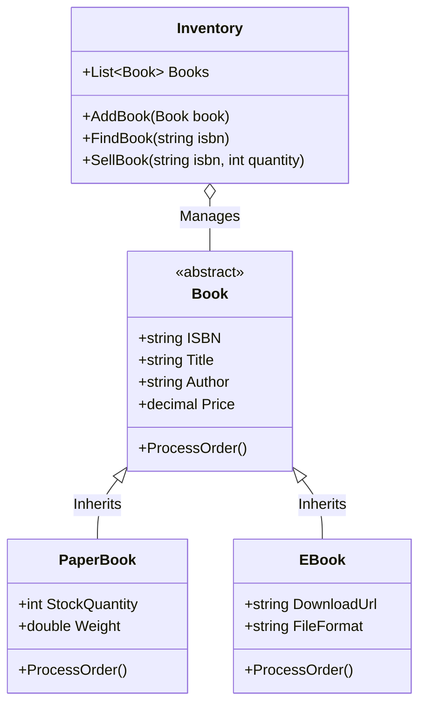

<div align="center">

# 📚 Bookstore_Fawry
### Polymorphic Bookstore Inventory & Order Management System (Fawry Challenge)

[](https://dotnet.microsoft.com/)
[](https://learn.microsoft.com/en-us/dotnet/csharp/)
[](#-system-architecture)
[](LICENSE)
[](https://github.com/OmarAlfar0uk)

<p align="center">
  <a href="#-key-features">Key Features</a> •
  <a href="#-system-architecture">System Architecture</a> •
  <a href="#-tech-stack">Tech Stack</a> •
  <a href="#-getting-started">Getting Started</a> •
  <a href="#-author">Author</a>
</p>

</div>

---

## 📌 Executive Overview

**Bookstore_Fawry** is an elegant Object-Oriented bookstore inventory and sales management solution engineered in C# for the **Fawry Internship Challenge**. It cleanly models the coexistence of physical **PaperBooks** (requiring shipping details, weight, and shelf stock management) and digital **EBooks** (requiring instant download URL generation and digital rights delivery).

> [!NOTE]
> Adheres to the **Open/Closed Principle (OCP)** and **Liskov Substitution Principle (LSP)**, allowing new publication formats (such as Audiobooks) to be added without modifying existing inventory logic.

---

## ✨ Key Features

| ⚡ Feature | 💡 Description | 🛠 Engineering Detail |
|---|---|---|
| **📖 PaperBook Management** | Physical inventory tracking, weight, and shipping costs | Stock decrement upon purchase with backorder alerts |
| **📱 EBook Delivery** | Instant digital fulfillment and license link delivery | Direct download URL generation without freight costs |
| **📦 Dynamic Inventory Engine** | Query books by ISBN, Title, Author, or format | Centralized `Inventory` collection with LINQ queries |
| **🧾 Automated Billing** | Purchase invoice calculation including tax and shipping | Polymorphic calculation depending on format |

---

## 🏛 System Architecture



---

## ⚡ Tech Stack

- **Platform:** .NET 8 / C# 12
- **Paradigm:** Object-Oriented Programming (OOP) & Clean Code
- **Host:** Console Application

---

## 🚀 Getting Started

1. **Clone repository:**
   ```bash
   git clone https://github.com/OmarAlfar0uk/Bookstore_Fawry.git
   cd Bookstore_Fawry
   ```

2. **Run Application:**
   ```bash
   dotnet run --project Bookstore_Fawry/Bookstore_Fawry.csproj
   ```

---

## 👨‍💻 Author

**Omar Alfarouk**  
*Full-Stack .NET & Software Engineer*  

- 🌐 **GitHub:** [@OmarAlfar0uk](https://github.com/OmarAlfar0uk)
- 💼 **LinkedIn:** [omar-alfarouk](https://www.linkedin.com/in/omar-alfarouk-252471251/)
- 📧 **Email:** [omaralfarouk646@gmail.com](mailto:omaralfarouk646@gmail.com)

---

<div align="center">
  <sub>Built with ❤️ by Omar Alfarouk. Licensed under the <a href="LICENSE">MIT License</a>.</sub>
</div>
